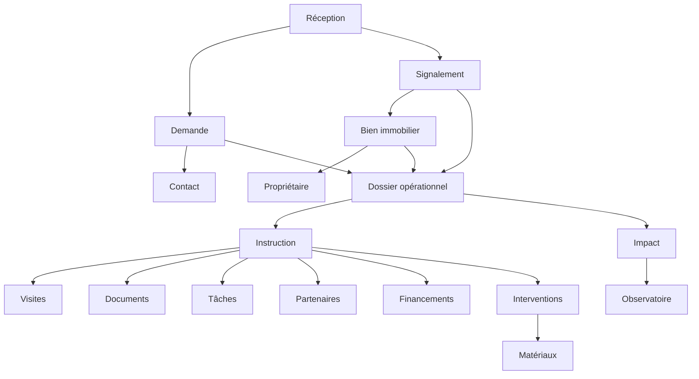

# Cadrage de refonte TVF OS

**Document de travail interne**  
**Projet :** TVF OS — Système opérationnel de revitalisation immobilière et territoriale  
**Organisation :** Territoires Vivants France  
**Version :** cadrage préalable à la refonte  
**Date :** 30 juillet 2026

## 1. Positionnement

TVF OS doit devenir le système d'exploitation métier de Territoires Vivants France, utilisée comme Agence Territoriale de Revitalisation Immobilière. La plateforme ne doit pas être traitée comme un CRM commercial classique. Elle doit organiser le cycle complet d'une situation territoriale : réception, qualification, instruction, mobilisation, suivi, remise en usage et mesure d'impact.

La règle de fond est la séparation claire entre les objets métiers :

- un **contact** est une personne ou une organisation ;
- une **demande** est une sollicitation reçue ;
- un **signalement** est une information liée à un bien ou à une situation territoriale ;
- un **bien immobilier** est un objet patrimonial ou foncier suivi dans le temps ;
- un **propriétaire** est un acteur lié à un ou plusieurs biens ;
- un **dossier opérationnel** est une instruction ouverte après qualification ;
- une **intervention** est une action concrète sur un dossier ;
- un **projet** regroupe parfois plusieurs biens, partenaires ou actions ;
- un **partenaire** intervient selon un rôle défini ;
- un **financement** est une piste, une demande ou une ressource liée à un dossier.

Aucune donnée de démonstration ne doit être présentée comme réelle. Les indicateurs doivent être calculés depuis la base lorsque les données existent, sinon afficher un état explicite : `Donnée en consolidation`, `Aucune donnée réelle disponible` ou `Module en préparation`.

## 2. Architecture actuelle observée

### 2.1 Structure générale

Le projet actuel est un site statique enrichi par des scripts JavaScript et des API serverless. TVF OS est principalement construit autour de pages `admin-*.html`, de scripts `admin-*.js`, d'un routeur API générique et de migrations Supabase par module.

Éléments constatés :

- pages HTML TVF OS : `admin.html`, `admin-demandes.html`, `admin-dossiers.html`, `admin-crm.html`, `admin-documents.html`, `admin-emails.html`, `admin-observatoire.html`, `admin-map.html`, `admin-work.html`, `admin-ai.html`, `admin-settings.html`, `admin-users.html`, `admin-impact.html`, `dashboard.html` ;
- modules anciens ou à réévaluer : `admin-branches`, `admin-governance`, `admin-risks`, `admin-finances`, `admin-knowledge`, `admin-procedures` ;
- API principale : `api/admin/[module].js` avec délégation vers `lib/api/admin-*.js` ;
- API contact publique : `api/contact.js` ;
- base Supabase décrite par de nombreux fichiers `supabase/tvf-os-*.sql` ;
- tests opérationnels dans `scripts/` et `tests/` ;
- application mobile Expo dans `mobile/tvf-mobile` avec contrat de synchronisation vers TVF OS.

### 2.2 État de l'interface TVF OS

La page `admin.html` a été remise à zéro graphiquement. Elle sert actuellement de base neutre avec les grands besoins suivants :

- Réception des demandes ;
- Dossiers ;
- Contacts et CRM ;
- Documents ;
- Observatoire et carte ;
- Travail et calendrier ;
- E-mails ;
- Paramètres.

Les modules fonctionnels n'ont pas été supprimés. Le design précédent a été neutralisé, mais plusieurs pages secondaires conservent encore des structures, menus, textes ou styles anciens.

Point important : des caracteres casses etaient visibles dans certains fichiers admin, notamment dans des libelles de reception, de parametres et de navigation. Ces libelles doivent rester corriges dans la phase de socle avant la nouvelle UI.

### 2.3 API actuelle

Le routeur `api/admin/[module].js` expose les modules suivants :

- `cases` ;
- `contacts` ;
- `session` ;
- `ai` ;
- `branches` ;
- `crm` ;
- `documents` ;
- `emails` ;
- `finances` ;
- `governance` ;
- `impact` ;
- `knowledge` ;
- `map` ;
- `observatoire` ;
- `procedures` ;
- `risks` ;
- `settings` ;
- `users` ;
- `work`.

Le modèle actuel est modulaire, mais il mélange des modules réellement utiles pour la future agence avec des modules devenus hors sujet ou trop anciens. Le routage est à conserver, mais il faut renommer, réorganiser et sécuriser les modules autour du nouveau modèle métier.

### 2.4 Authentification et sécurité actuelle

Le système actuel repose principalement sur un token administrateur (`TVF_ADMIN_TOKEN`) lu côté API, avec cookie de session signé et `Authorization: Bearer`. Des tables `profiles`, `roles`, `permissions`, `role_permissions` et `user_roles` existent dans les migrations, mais l'application n'apparaît pas encore entièrement organisée autour d'un contrôle fin par rôle et par action.

À améliorer impérativement :

- authentification utilisateur réelle ;
- permissions par action ;
- vérification côté serveur et côté base ;
- RLS Supabase stricte ;
- journalisation complète ;
- séparation des profils internes et externes ;
- visibilité limitée pour propriétaires, collectivités, entreprises et prestataires.

## 3. Fonctionnalités existantes à conserver

### 3.1 Réception et demandes

Le module `admin-demandes` contient déjà une logique de boîte de réception multicanale : formulaires du site, e-mails, TVF Mobile, appels, courriers papier et demandes manuelles. Il contient aussi des actions de qualification, de transformation en dossier, de réponse, d'affectation et de rattachement.

À conserver :

- notion de demande entrante ;
- numéro ou référence interne ;
- filtres par statut, canal, catégorie, priorité ;
- transformation en dossier ;
- création manuelle ;
- import ou lecture TVF Mobile ;
- rattachement aux documents ;
- export CSV uniquement si autorisé.

À revoir :

- statuts à aligner avec la nouvelle nomenclature ;
- vocabulaire trop CRM ;
- surabondance de boutons ;
- interface à reconstruire ;
- séparation entre demande, signalement, bien et dossier.

### 3.2 Contacts et CRM

Le module `admin-crm` et l'API `admin-contacts` fournissent déjà une base pour contacts, organisations, relations et détection de doublons.

À conserver :

- contacts ;
- organisations ;
- historique relationnel ;
- suggestions de doublons ;
- liens avec demandes et dossiers.

À transformer :

- le CRM ne doit plus être présenté comme un module commercial ;
- il doit devenir `Acteurs` ou `Contacts et organisations` ;
- distinguer propriétaire, collectivité, entreprise, partenaire, financeur, prestataire.

### 3.3 Dossiers

Le module `admin-dossiers` et l'API `admin-cases` existent. Les migrations créent déjà `cases`, `case_participants`, `case_checklist_items`, `case_status_history`, `case_risks`, `case_decisions`.

À conserver :

- dossier avec numéro ;
- statut ;
- priorité ;
- participants ;
- checklist ;
- historique ;
- décisions ;
- risques, à renommer éventuellement `points de vigilance` si l'utilisateur ne veut plus voir un bloc risques.

À améliorer :

- onglets métier ;
- parcours d'instruction guidé ;
- lien fort avec un bien immobilier ;
- visites ;
- documents ;
- interventions ;
- financements ;
- conventions ;
- impact ;
- clôture.

### 3.4 Documents

Le module documents possède déjà une bibliothèque interne, des modèles, des versions, des liens et de l'audit documentaire.

À conserver :

- bibliothèque interne TVF ;
- pièces à fournir ;
- modèles ;
- versions ;
- rattachement à plusieurs objets ;
- génération de documents.

À améliorer :

- droits par objet ;
- demandes de document au propriétaire ;
- signatures ;
- expiration ;
- validation ;
- stockage sécurisé et traçabilité.

### 3.5 Messagerie

Le module `admin-emails` et les tables `email_messages`, `email_attachments`, `email_tasks`, `email_workflow_events`, `email_ai_suggestions` existent dans les migrations.

À conserver :

- conversion d'e-mail en demande ;
- réponses ;
- pièces jointes ;
- historique.

À améliorer :

- connexion réelle Gmail/Google Workspace ;
- rattachement automatique par référence ;
- modèles de réponse ;
- accusés de réception ;
- envoi via Resend pour les notifications applicatives ;
- séparation entre e-mail de communication et suivi officiel dans TVF OS.

### 3.6 TVF Mobile

Le dossier `mobile/tvf-mobile` contient un contrat de liaison avec TVF OS. La table `mobile_requests` est prévue. Le principe est que TVF Mobile alimente TVF OS, sans être une application indépendante.

À conserver :

- flux `signal`, `materials`, `property`, `volunteer` ;
- table `mobile_requests` ;
- photos via buckets attendus ;
- contrat de qualification ;
- synchronisation vers demandes reçues.

À améliorer :

- profils mobiles ;
- offline temporaire ;
- enrichissement dossier depuis le terrain ;
- timeline automatique ;
- affectation au chargé de mission.

## 4. Doublons et confusions à résoudre

1. **Demandes / signalements / dossiers** : les demandes reçues et les signalements ne doivent pas ouvrir automatiquement un dossier complet.
2. **CRM / propriétaires / partenaires** : le CRM actuel doit devenir une base d'acteurs ; les propriétaires doivent avoir une fiche dédiée.
3. **Observatoire / map / dashboard** : les données territoriales, la cartographie et les indicateurs doivent partager une source unique.
4. **Documents publics / documents internes** : les modèles téléchargeables du site et les documents de dossier TVF OS doivent être séparés.
5. **Anciennes rubriques** : branches, governance et risks ne correspondent plus à la ligne demandée et doivent être retirés de la navigation visible, puis réaffectés ou archivés techniquement.
6. **Statuts** : plusieurs modules utilisent des statuts différents. Il faut des statuts par objet métier, pas un statut unique pour tout.
7. **Indicateurs** : aucun chiffre statique ne doit apparaître comme réel.
8. **Interface** : trop de boutons anciens et de blocs explicatifs doivent être supprimés ou transformés en actions contextualisées.

## 5. Fonctionnalités manquantes

### 5.1 Socle métier

- fiche bien immobilier indépendante ;
- fiche propriétaire dédiée ;
- table de liaison bien/propriétaire ;
- signalements distincts des demandes ;
- parcours d'instruction configurable ;
- visites ;
- interventions ;
- financements liés au dossier ;
- programmes et aides ;
- banque de matériaux complète ;
- conventions ;
- impact consolidé ;
- portails externes.

### 5.2 Socle technique

- authentification utilisateur complète ;
- rôles et permissions actifs ;
- RLS Supabase stricte ;
- journaux d'activité par modification ;
- stockage sécurisé des fichiers ;
- moteur d'automatisation traçable ;
- centre de notifications ;
- API homogènes ;
- tests de permissions ;
- migration propre depuis les tables existantes.

### 5.3 Interface métier

- shell TVF OS unifié ;
- barre latérale gauche rétractable ;
- barre supérieure avec recherche globale ;
- vues par rôle ;
- panneaux latéraux ;
- timeline dossier ;
- actions rapides contextuelles ;
- responsive terrain ;
- design system Manrope / Inter.

## 6. Nouvelle architecture cible

### 6.1 Frontend

Architecture recommandée :

- `TVF OS Shell` : layout commun, navigation, recherche, notifications ;
- `Role Router` : affichage selon rôle ;
- `Modules` : réception, demandes, signalements, dossiers, biens, propriétaires, cartographie, partenaires, aides, matériaux, interventions, documents, observatoire, agenda, messagerie, rapports, administration ;
- `Design System` : boutons, badges, tableaux, cartes, formulaires, panneaux, timeline, modales ;
- `Mobile-first terrain` : écrans utilisables sur tablette et smartphone.

### 6.2 Backend/API

Organisation cible :

- `/api/admin/session` ou `/api/auth/*` ;
- `/api/admin/reception` ;
- `/api/admin/requests` ;
- `/api/admin/reports` ;
- `/api/admin/cases` ;
- `/api/admin/properties` ;
- `/api/admin/owners` ;
- `/api/admin/contacts` ;
- `/api/admin/partners` ;
- `/api/admin/programs` ;
- `/api/admin/materials` ;
- `/api/admin/interventions` ;
- `/api/admin/documents` ;
- `/api/admin/messages` ;
- `/api/admin/tasks` ;
- `/api/admin/notifications` ;
- `/api/admin/observatory` ;
- `/api/admin/ai` ;
- `/api/mobile/*`.

Chaque API doit vérifier :

- l'utilisateur ;
- son rôle ;
- son territoire ;
- son droit sur l'action ;
- la confidentialité de l'objet demandé.

### 6.3 Base de données

La base cible doit être relationnelle, traçable et construite par migrations successives. Les tables déjà existantes ne doivent pas être recréées aveuglément.

Tables à conserver ou aligner :

- `profiles`, `roles`, `permissions`, `role_permissions`, `user_roles` ;
- `crm_contacts`, `organizations`, `organization_contacts`, `relationship_history` ;
- `cases`, `case_participants`, `case_checklist_items`, `case_status_history`, `case_decisions` ;
- `documents`, `document_versions`, `document_links`, `generated_documents`, `document_audit_logs` ;
- `email_messages`, `email_attachments`, `email_tasks`, `email_workflow_events` ;
- `mobile_requests` ;
- `work_tasks`, `work_events`, `work_activity_log` ;
- `ai_suggestions`, `ai_interactions`, `ai_feedback` ;
- `impact_metrics`, `impact_reports`, `impact_values`.

Tables à créer ou normaliser :

- `territories` ;
- `contacts` ou vue unifiée au-dessus de `crm_contacts` ;
- `owners` ;
- `properties` ;
- `property_owners` ;
- `reports` pour signalements ;
- `requests` pour demandes reçues ;
- `case_steps` ;
- `assignments` ;
- `visits` ;
- `tasks` ;
- `events` ;
- `messages` ;
- `email_threads` ;
- `partners` ;
- `funders` ;
- `programs` ;
- `funding_opportunities` ;
- `case_funding_matches` ;
- `interventions` ;
- `contractors` ;
- `quotes` ;
- `invoices` ;
- `material_donations` ;
- `materials` ;
- `material_stocks` ;
- `material_movements` ;
- `agreements` ;
- `notifications` ;
- `automation_rules` ;
- `automation_logs` ;
- `activity_logs` ;
- `impact_indicators`.

## 7. Relations entre modules

Relations principales :

- un contact peut créer plusieurs demandes ;
- une demande peut être rattachée à un contact, un bien, un signalement ou un dossier ;
- un bien peut avoir plusieurs propriétaires ;
- un propriétaire peut avoir plusieurs biens ;
- un bien peut générer plusieurs dossiers dans le temps ;
- un dossier peut mobiliser plusieurs partenaires, financements, documents, visites, tâches et interventions ;
- une intervention peut consommer des matériaux ;
- l'Observatoire agrège les données validées, sans exposer les données confidentielles.

## 8. Rôles et permissions

Rôles cibles :

- administrateur ;
- direction ;
- responsable de pôle ;
- chargé de mission ;
- agent d'accueil ;
- agent terrain ;
- observateur interne ;
- collectivité partenaire ;
- propriétaire ;
- entreprise ;
- financeur ;
- prestataire.

Actions à contrôler :

- voir ;
- créer ;
- modifier ;
- supprimer ;
- affecter ;
- valider ;
- exporter ;
- télécharger ;
- accéder aux données confidentielles ;
- administrer.

Règle impérative : masquer un bouton dans l'interface ne suffit pas. La permission doit être contrôlée par l'API et, autant que possible, par les politiques RLS Supabase.

## 9. Arborescence fonctionnelle cible

Menu latéral :

1. Tableau de bord
2. Réception
3. Demandes
4. Signalements
5. Dossiers
6. Biens immobiliers
7. Cartographie
8. Propriétaires
9. Instruction et suivi
10. Partenaires et financeurs
11. Programmes et aides
12. Banque de matériaux
13. Interventions et travaux
14. Observatoire
15. Agenda
16. Messagerie
17. Documents
18. Rapports
19. Administration et paramètres

Le menu doit être adapté au rôle. Les modules non autorisés ne doivent pas être visibles.

## 10. Maquettes textuelles des écrans

### 10.1 Tableau de bord

- barre supérieure : recherche globale, créer, nouvelle demande, notifications, messagerie, aide, avatar ;
- carte territoriale au centre ;
- widgets à droite : dossiers ouverts, priorités, rendez-vous, nouveaux signalements, actions du jour ;
- rangée d'indicateurs calculés depuis la base ;
- liste activité récente ;
- alertes et tâches prioritaires.

### 10.2 Réception

- colonne gauche : sources et files ;
- centre : demandes triées ;
- droite : contenu, résumé, pièces jointes, actions ;
- actions : répondre, qualifier, affecter, créer contact, créer bien, ouvrir dossier, classer.

### 10.3 Dossier

- en-tête : photo, adresse, référence, statut, chargé de mission ;
- onglets : vue générale, bien, contacts, propriétaires, instruction, visites, diagnostic, documents, échanges, tâches, partenaires, financements, interventions, conventions, photos, historique, impact, clôture ;
- timeline complète ;
- actions rapides contextuelles.

### 10.4 Bien immobilier

- fiche indépendante ;
- adresse, GPS, commune, parcelle, type, état, occupation, photos ;
- signalements liés ;
- demandes liées ;
- dossiers liés ;
- propriétaires ;
- doublons potentiels.

### 10.5 Matériauthèque

- vue inventaire proche d'une fiche produit professionnelle ;
- statut : proposé, à vérifier, accepté, collecté, contrôlé, disponible, réservé, affecté, utilisé, sorti, archivé ;
- mouvements d'entrée/sortie ;
- rattachement à dossier ou intervention ;
- justificatif.

## 11. Parcours utilisateurs

### 11.1 Accueil et réception

1. reçoit une demande ;
2. recherche un contact existant ;
3. crée ou rattache le contact ;
4. qualifie rapidement ;
5. demande un complément si besoin ;
6. affecte à un chargé de mission ;
7. envoie un accusé de réception ;
8. transforme en dossier uniquement si nécessaire.

### 11.2 Chargé de mission

1. ouvre les demandes affectées ;
2. qualifie le bien et la situation ;
3. prépare le contact propriétaire ;
4. programme une visite ;
5. complète la grille de visite ;
6. dépose les documents ;
7. sollicite les partenaires ;
8. propose un plan d'action ;
9. suit la mise en œuvre ;
10. prépare la clôture.

### 11.3 Direction

1. supervise tous les modules ;
2. consulte les indicateurs ;
3. valide les conventions importantes ;
4. contrôle les risques juridiques et financiers ;
5. suit les financements ;
6. produit les bilans ;
7. administre les rôles et territoires.

### 11.4 Collectivité partenaire

1. consulte les dossiers autorisés ;
2. dépose des informations ;
3. consulte les indicateurs de son territoire ;
4. reçoit des rapports ;
5. échange avec TVF.

### 11.5 Propriétaire

1. consulte son dossier ;
2. dépose ses pièces ;
3. prend rendez-vous ;
4. répond aux demandes ;
5. télécharge courriers et conventions ;
6. suit les étapes visibles.

## 12. Statuts recommandés

### 12.1 Demandes

- nouvelle ;
- à lire ;
- à qualifier ;
- informations demandées ;
- en attente du demandeur ;
- affectée ;
- en cours de traitement ;
- orientée ;
- transformée en dossier ;
- réponse apportée ;
- classée sans suite ;
- clôturée ;
- indésirable.

### 12.2 Dossiers

1. Nouveau dossier ;
2. Qualification en cours ;
3. Contact en cours ;
4. En attente du propriétaire ;
5. Visite à programmer ;
6. Visite réalisée ;
7. Étude en cours ;
8. Recherche de solutions ;
9. Partenaires mobilisés ;
10. Financement recherché ;
11. Plan d'action proposé ;
12. Convention en préparation ;
13. Projet engagé ;
14. Intervention en cours ;
15. Contrôle final ;
16. Bien remis en usage ;
17. Dossier suspendu ;
18. Dossier abandonné ;
19. Dossier clôturé.

## 13. Automatisations à prévoir

- création automatique des numéros ;
- accusé de réception ;
- tâche après affectation ;
- rappel avant visite ;
- alerte dossier sans action ;
- relance après courrier ;
- demande de document manquant ;
- notification de changement de statut ;
- alerte document expirant ;
- rapport mensuel ;
- proposition de financement ;
- mise à jour d'indicateurs.

Chaque automatisation doit être traçable, configurable et désactivable.

## 14. TVF IA

TVF IA doit assister sans décider.

Fonctions autorisées :

- résumer une demande ;
- proposer une catégorie ;
- détecter les informations manquantes ;
- suggérer un parcours ;
- rechercher des partenaires dans la base ;
- proposer des aides présentes dans la base ;
- préparer un courrier ;
- résumer les échanges ;
- générer un compte rendu ;
- identifier les échéances ;
- signaler un retard ;
- comparer des devis ;
- préparer un rapport.

Affichage obligatoire : `Suggestion de TVF IA — à vérifier et valider par un utilisateur`.

## 15. Sécurité et conformité

À mettre en place progressivement :

- authentification sécurisée ;
- récupération du mot de passe ;
- double authentification si possible ;
- journal des connexions ;
- journal des actions ;
- rôles et permissions ;
- contrôle des téléchargements ;
- stockage sécurisé ;
- sauvegardes ;
- RLS Supabase ;
- protection des données personnelles ;
- consentements ;
- durée de conservation ;
- suppression ou anonymisation ;
- export des données ;
- traçabilité des modifications.

Chaque modification importante doit enregistrer : utilisateur, date, ancienne valeur, nouvelle valeur et objet concerné.

## 16. Plan de migration

### 16.1 Étape préparatoire

- figer la navigation actuelle ;
- corriger les caractères cassés ;
- retirer de la navigation visible les modules hors ligne métier ;
- inventorier les tables réellement déployées dans Supabase ;
- comparer migrations dépôt et base réelle ;
- identifier les données à conserver ;
- sauvegarder avant toute migration.

### 16.2 Migration métier

- créer ou aligner `requests` ;
- créer ou aligner `reports` ;
- créer `properties` ;
- créer `owners` ;
- créer `property_owners` ;
- rattacher les demandes existantes ;
- rattacher les dossiers existants ;
- migrer les pièces jointes vers le modèle documentaire ;
- reconstruire les statuts.

### 16.3 Migration sécurité

- activer rôles réels ;
- créer matrice permissions ;
- mettre en place RLS ;
- tester chaque rôle ;
- journaliser les accès et modifications.

## 17. Plan de développement par phases

### Phase 1 — Audit et architecture

- finaliser l'analyse du projet ;
- vérifier la base réelle ;
- valider ce document ;
- produire schéma SQL cible ;
- produire plan de migration.

### Phase 2 — Socle technique

- authentification ;
- profils ;
- rôles ;
- territoires ;
- navigation ;
- design system ;
- permissions ;
- journal d'activité.

### Phase 3 — Réception et demandes

- boîte de réception ;
- contacts ;
- demandes ;
- qualification ;
- affectation ;
- transformation en dossier.

### Phase 4 — Dossiers et instruction

- dossiers ;
- biens ;
- propriétaires ;
- étapes ;
- visites ;
- documents ;
- tâches ;
- chronologie.

### Phase 5 — Écosystème opérationnel

- partenaires ;
- financeurs ;
- programmes ;
- interventions ;
- matériaux ;
- conventions.

### Phase 6 — Cartographie et observatoire

- carte ;
- indicateurs ;
- rapports ;
- exports.

### Phase 7 — Messagerie, automatisations et IA

Statut de construction : socle consolidé dans TVF OS.

- réception e-mail centralisée dans le module E-mails intelligents ;
- préparation du flux Gmail / Google Workspace sans modification DNS ;
- envoi applicatif prévu via Resend pour notifications et accusés ;
- modèles de réponse visibles côté traitement e-mail ;
- automatisations consultables et traçables ;
- suggestions TVF IA validables par humain ;
- notifications et tâches rattachées au suivi opérationnel.

### Phase 8 — Portails externes et TVF Mobile

- portail propriétaire ;
- portail collectivité ;
- portail prestataire ;
- application terrain ;
- synchronisation.

## 18. Tests attendus à chaque phase

- test JavaScript ;
- test API admin ;
- test flux utilisateur ;
- test flux formulaire site ;
- test TVF Mobile vers TVF OS ;
- test e-mail / Resend ;
- test permissions ;
- test RLS ;
- test responsive ;
- test absence de données fictives non signalées ;
- test encodage accents.

Le script `npm run check` existe déjà et doit rester la base minimale de validation, complétée par des tests spécifiques aux permissions et migrations.

## 19. Risques techniques

- migrations Supabase nombreuses, certaines potentiellement redondantes ;
- modules anciens encore référencés dans l'API ;
- permissions encore trop dépendantes d'un token admin ;
- risque de confusion entre contacts, propriétaires et organisations ;
- risque de doublons entre demandes, signalements et dossiers ;
- encodage cassé sur certains fichiers admin ;
- intégration Gmail nécessitant OAuth et validation de sécurité ;
- stockage documentaire à sécuriser ;
- données de test à séparer strictement des données réelles ;
- interface mobile terrain nécessitant un mode dégradé hors connexion.

## 20. Points nécessitant validation

Avant d'engager la refonte technique, validation nécessaire sur :

1. nom définitif des modules du menu ;
2. rôles internes et externes à activer en premier ;
3. statut exact des anciens modules `branches`, `governance`, `risks` ;
4. modèle de numérotation demandes et dossiers ;
5. choix entre conserver `crm_contacts` ou créer une table `contacts` unifiée ;
6. politique de visibilité des données propriétaires ;
7. périmètre du premier portail externe ;
8. Gmail : lecture via API Google ou simple webhook/import au lancement ;
9. stockage documents : Supabase Storage ou autre solution sécurisée ;
10. priorisation entre cartographie, dossiers et messagerie ;
11. séparation des données démonstration et production ;
12. niveau de détail de TVF IA en phase 1.

## 21. Recommandation de démarrage

La première vraie phase de code doit être limitée au socle suivant :

1. corriger les accents des modules admin ;
2. retirer les modules hors ligne métier de la navigation visible ;
3. créer le shell TVF OS neutre et role-ready ;
4. stabiliser Réception, Demandes, Contacts, Dossiers et Documents ;
5. ajouter les entités `properties`, `owners`, `property_owners`, `reports` si elles n'existent pas en base réelle ;
6. créer la matrice permissions ;
7. écrire les tests de droits ;
8. ne pas ajouter d'indicateurs fictifs.

Cette approche évite de recréer un grand logiciel en apparence seulement. Elle transforme progressivement les briques existantes en véritable système opérationnel de revitalisation immobilière et territoriale.

