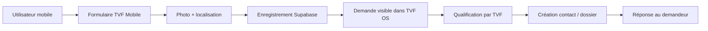

# Cahier des charges fonctionnel - TVF Mobile V1

**Territoires Vivants France**  
**Application mobile : TVF Mobile**  
**Version de cadrage : V1 - MVP terrain**  
**Date : juillet 2026**

---

## 1. Objet du document

Ce cahier des charges définit la première version de l'application mobile **TVF Mobile**.

L'objectif n'est pas de reproduire tout le site internet ni TVF OS dans une application mobile. L'application doit devenir un **outil terrain simple, rapide et utile** pour permettre aux habitants, propriétaires, entreprises, bénévoles et premiers interlocuteurs locaux de signaler, localiser, documenter et transmettre des informations exploitables à Territoires Vivants France.

TVF Mobile doit être pensée comme une porte d'entrée opérationnelle :

- photographier une situation ;
- géolocaliser un lieu ou une ressource ;
- transmettre une demande claire ;
- suivre l'avancement ;
- permettre à TVF OS de transformer la demande en dossier.

La V1 doit rester volontairement simple. Elle doit être fiable, compréhensible et utilisable sur le terrain, y compris par une personne qui découvre TVF.

---

## 2. Positionnement de TVF Mobile

TVF Mobile est l'application de signalement, de contribution et de suivi terrain de Territoires Vivants France.

Elle permet de remonter des informations liées à :

- un logement vacant ;
- un commerce fermé ;
- un bâtiment inutilisé ;
- une friche ou un terrain abandonné ;
- des matériaux réutilisables ;
- un bien proposé par un particulier ;
- une volonté de bénévolat ou de participation ;
- une demande de contact avec TVF.

TVF Mobile ne doit pas promettre une intervention automatique. Chaque signalement ou proposition doit être présenté comme une **demande à qualifier**.

Formulation à retenir :

> Signaler, localiser, documenter et transmettre une situation pouvant être étudiée par Territoires Vivants France.

---

## 3. Publics concernés

### 3.1 Citoyens

Besoin principal : signaler rapidement un lieu vacant, dégradé, inutilisé ou une situation qui mérite d'être portée à la connaissance de TVF.

Fonctions utiles :

- signalement rapide ;
- photo ;
- localisation ;
- courte description ;
- suivi du statut.

### 3.2 Propriétaires particuliers

Besoin principal : proposer un bien dormant ou une ressource inutilisée et comprendre les pièces nécessaires.

Fonctions utiles :

- proposer un logement, local, bâtiment, terrain ou friche ;
- ajouter photos et coordonnées ;
- télécharger la liste des pièces à fournir ;
- demander un rendez-vous ;
- suivre le dossier.

### 3.3 Entreprises

Besoin principal : proposer des matériaux, équipements, mobilier, local ou soutien opérationnel.

Fonctions utiles :

- proposer des matériaux ;
- décrire quantité, état, localisation ;
- ajouter photos ;
- indiquer disponibilité ;
- demander un échange partenariat.

### 3.4 Bénévoles

Besoin principal : rejoindre une action, proposer une compétence ou participer à une mission.

Fonctions utiles :

- inscription bénévole ;
- choix des disponibilités ;
- choix des compétences ;
- réception des missions ;
- notifications.

### 3.5 TVF / administrateurs

Besoin principal : recevoir des demandes exploitables et les transformer en dossiers TVF OS.

Fonctions utiles côté TVF OS :

- réception des signalements ;
- création automatique d'une demande ;
- rattachement à un contact ;
- création d'un dossier ;
- suivi de statut ;
- historique ;
- réponse au demandeur.

---

## 4. Objectifs de la V1

La première version doit permettre :

1. De signaler un lieu depuis un téléphone.
2. De proposer des matériaux ou équipements.
3. De proposer un bien par un propriétaire.
4. De transmettre une photo et une localisation.
5. De créer automatiquement une demande dans TVF OS.
6. D'envoyer un accusé de réception par e-mail.
7. De suivre un statut simple.
8. De consulter les documents utiles.
9. De contacter TVF rapidement.

La V1 ne doit pas encore gérer :

- une marketplace publique ;
- une carte publique ouverte à tous ;
- des discussions instantanées complexes ;
- une gestion complète multi-antennes ;
- un paiement intégré ;
- une validation automatique des projets.

---

## 5. Architecture recommandée

### 5.1 Technologie proposée

Solution recommandée : **Expo / React Native**.

Raisons :

- une seule base de code pour Android et iOS ;
- développement rapide ;
- accès caméra, galerie, géolocalisation ;
- compatibilité avec Supabase ;
- possibilité de tester rapidement sur téléphone ;
- évolution possible vers publication Play Store et App Store.

### 5.2 Connexions existantes

TVF Mobile doit s'appuyer sur l'écosystème déjà en place :

- **Supabase** : base de données, authentification, stockage photos ;
- **TVF OS** : traitement interne des demandes ;
- **Brevo** : e-mails de confirmation et notifications ;
- **Site TVF** : documentation publique et liens utiles ;
- **WhatsApp TVF** : contact rapide si besoin.

### 5.3 Principe de flux

---

## 6. Parcours utilisateurs principaux

### 6.1 Parcours 1 - Signaler un lieu

Objectif : permettre à un citoyen de signaler une situation utile à qualifier.

Étapes :

1. L'utilisateur ouvre l'application.
2. Il clique sur **Signaler un lieu**.
3. Il choisit une catégorie :
   - logement vacant ;
   - commerce fermé ;
   - bâtiment abandonné ;
   - friche ;
   - terrain inutilisé ;
   - dépôt sauvage ;
   - autre situation.
4. Il prend une photo ou sélectionne une photo.
5. Il autorise ou saisit la localisation.
6. Il ajoute une courte description.
7. Il indique s'il souhaite être recontacté.
8. Il valide l'envoi.
9. TVF reçoit la demande dans TVF OS.
10. L'utilisateur reçoit un accusé de réception.

Statuts possibles :

- reçu ;
- à vérifier ;
- à compléter ;
- en étude ;
- orienté ;
- clôturé.

### 6.2 Parcours 2 - Proposer des matériaux

Objectif : permettre à une entreprise ou un particulier de proposer une ressource réutilisable.

Champs à prévoir :

- type de matériau ;
- quantité ;
- état ;
- dimensions si connues ;
- localisation ;
- date limite de disponibilité ;
- photos ;
- contraintes de manutention ;
- coordonnées du proposant.

Catégories :

- bois ;
- portes ;
- fenêtres ;
- sanitaires ;
- carrelage ;
- mobilier ;
- luminaires ;
- équipements ;
- outillage ;
- matériaux divers.

Message important :

> Les matériaux proposés sont étudiés par TVF. Leur proposition ne vaut pas acceptation automatique ni enlèvement immédiat.

### 6.3 Parcours 3 - Proposer un bien

Objectif : permettre à un propriétaire de présenter un bien pouvant faire l'objet d'une étude TVF.

Types de biens :

- logement vacant ;
- maison ;
- immeuble ;
- commerce ;
- local d'activité ;
- bâtiment inutilisé ;
- terrain ;
- friche ;
- dépendance ou espace annexe.

Informations demandées :

- identité du propriétaire ou représentant ;
- adresse du bien ;
- type de bien ;
- état général ;
- photos ;
- surface approximative ;
- disponibilité ;
- objectif recherché ;
- demande de rendez-vous ;
- documents disponibles.

Lien direct à prévoir :

- brochure pièces à fournir particuliers ;
- brochure propriétaires ;
- contact TVF.

### 6.4 Parcours 4 - Devenir bénévole

Objectif : permettre à une personne de proposer du temps, une compétence ou une disponibilité.

Champs :

- nom ;
- prénom ;
- téléphone ;
- e-mail ;
- commune ;
- disponibilités ;
- compétences ;
- type de mission souhaitée.

Types de missions :

- repérage terrain ;
- appui administratif ;
- communication ;
- logistique ;
- manutention légère ;
- événement ;
- sensibilisation ;
- photographie ;
- accompagnement numérique ;
- chantier participatif si cadre adapté.

### 6.5 Parcours 5 - Suivre ma demande

Objectif : permettre à l'utilisateur de comprendre où en est sa demande sans appeler systématiquement TVF.

Fonctions :

- recherche par e-mail ou numéro de dossier ;
- affichage du statut ;
- message TVF si une pièce manque ;
- lien pour compléter la demande ;
- historique simple.

---

## 7. Écrans à prévoir

### 7.1 Écran de lancement

Contenu :

- logo TVF Mobile ;
- slogan : **Signaler. Localiser. Agir.**
- bouton principal : **Commencer**.

### 7.2 Accueil

Blocs principaux :

- Signaler un lieu ;
- Proposer des matériaux ;
- Proposer un bien ;
- Devenir bénévole ;
- Suivre ma demande ;
- Documents utiles ;
- Contacter TVF.

### 7.3 Signalement

Écrans :

1. Choix de catégorie.
2. Photo.
3. Localisation.
4. Description.
5. Coordonnées facultatives.
6. Récapitulatif.
7. Confirmation.

### 7.4 Matériaux

Écrans :

1. Catégorie.
2. Quantité et état.
3. Photos.
4. Adresse ou lieu de stockage.
5. Disponibilité.
6. Coordonnées.
7. Confirmation.

### 7.5 Bien proposé

Écrans :

1. Type de bien.
2. Adresse.
3. État général.
4. Photos.
5. Objectif du propriétaire.
6. Pièces disponibles.
7. Demande de rendez-vous.

### 7.6 Documents

Documents à intégrer en V1 :

- liste des pièces à fournir particuliers ;
- brochure particuliers ;
- brochure matériaux ;
- brochure entreprises ;
- brochure collectivités ;
- fiche contact TVF ;
- modèles de convention disponibles en consultation interne si nécessaire.

### 7.7 Contact

Boutons :

- appeler TVF ;
- envoyer un e-mail ;
- ouvrir WhatsApp ;
- ouvrir le site internet.

---

## 8. Données à enregistrer

### 8.1 Table signalements

Champs proposés :

- id ;
- type_signalement ;
- titre ;
- description ;
- adresse ;
- commune ;
- latitude ;
- longitude ;
- photo_url ;
- nom_contact ;
- email_contact ;
- telephone_contact ;
- statut ;
- date_creation ;
- source = mobile ;
- dossier_id si transformé en dossier.

### 8.2 Table matériaux

Champs proposés :

- id ;
- categorie ;
- description ;
- quantité ;
- état ;
- localisation ;
- latitude ;
- longitude ;
- photo_url ;
- disponibilité ;
- contact_nom ;
- contact_email ;
- contact_telephone ;
- statut ;
- date_creation ;
- source = mobile.

### 8.3 Table propositions_biens

Champs proposés :

- id ;
- type_bien ;
- adresse ;
- commune ;
- description ;
- état_general ;
- surface_estimee ;
- photos ;
- objectif_proprietaire ;
- contact_nom ;
- contact_email ;
- contact_telephone ;
- documents_disponibles ;
- statut ;
- date_creation ;
- dossier_id.

### 8.4 Table bénévoles

Champs proposés :

- id ;
- nom ;
- prénom ;
- email ;
- téléphone ;
- commune ;
- disponibilités ;
- compétences ;
- missions_souhaitées ;
- statut ;
- date_creation ;
- source = mobile.

---

## 9. Règles de statut

Statuts V1 recommandés :

- **Reçu** : la demande est bien enregistrée.
- **À vérifier** : TVF doit contrôler les informations.
- **À compléter** : des pièces ou informations manquent.
- **En étude** : TVF analyse la faisabilité.
- **Orienté** : la demande est orientée vers une suite, un interlocuteur ou un dossier.
- **Clôturé** : la demande ne fait plus l'objet d'un traitement actif.

Les statuts doivent être compréhensibles par le public et utilisables dans TVF OS.

---

## 10. Règles RGPD et sécurité

### 10.1 Données personnelles

Données concernées :

- nom ;
- prénom ;
- téléphone ;
- e-mail ;
- adresse ;
- photos ;
- localisation ;
- informations liées à un bien.

Règles :

- afficher une notice claire avant envoi ;
- demander uniquement les informations nécessaires ;
- ne pas afficher publiquement les signalements sans validation TVF ;
- permettre la demande de suppression ou de modification ;
- limiter l'accès administrateur ;
- sécuriser les fichiers dans Supabase Storage.

### 10.2 Photos

Message à afficher :

> Ne photographiez pas de personnes identifiables sans accord. Ne prenez pas de photo en entrant dans une propriété privée sans autorisation.

### 10.3 Géolocalisation

Message à afficher :

> La géolocalisation sert uniquement à situer le signalement ou la ressource transmise à TVF.

---

## 11. Design et identité

### 11.1 Direction artistique

Style attendu :

- moderne ;
- institutionnel ;
- clair ;
- terrain ;
- accessible ;
- rassurant.

L'application doit paraître plus simple que le site. Elle doit être pensée pour une utilisation rapide.

### 11.2 Couleurs

Palette recommandée :

- vert TVF : `#183F22` ;
- bleu profond : `#071E30` ;
- vert clair : `#EAF3EA` ;
- blanc cassé : `#F7FAF4` ;
- accent doré : `#B28418` ;
- gris texte : `#5F6862`.

### 11.3 Logo

Utiliser le logo **TVF Mobile** fourni par le fondateur pour :

- icône d'application ;
- splash screen ;
- écran de lancement ;
- documents de présentation mobile.

Prévoir deux exports :

- icône carrée 1024 x 1024 ;
- splash screen vertical 1242 x 2436.

### 11.4 Navigation

Navigation V1 recommandée :

- Accueil ;
- Signaler ;
- Carte ;
- Documents ;
- Suivi ;
- Contact.

Éviter trop d'onglets. Les actions principales doivent être visibles dès l'accueil.

---

## 12. Fonctionnalités V1

### Indispensable

- écran d'accueil ;
- signalement lieu ;
- proposition matériaux ;
- proposition bien ;
- formulaire bénévole ;
- upload photo ;
- géolocalisation ;
- envoi vers Supabase ;
- accusé de réception e-mail ;
- documents utiles ;
- contact rapide ;
- suivi simple.

### Recommandé

- carte interne des signalements ;
- recherche de dossier par e-mail ou numéro ;
- mode brouillon ;
- notifications e-mail ;
- filtre par catégorie ;
- historique côté utilisateur.

### À prévoir plus tard

- notification push ;
- espace utilisateur complet ;
- messagerie intégrée ;
- carte publique validée ;
- consultation de matériaux disponibles ;
- gestion de rendez-vous ;
- signature électronique ;
- mode hors ligne ;
- publication Play Store / App Store.

---

## 13. MVP recommandé

La V1 doit se concentrer sur cinq écrans d'action :

1. Signaler un lieu.
2. Proposer des matériaux.
3. Proposer un bien.
4. Devenir bénévole.
5. Suivre ma demande.

Objectif :

> Transformer chaque contribution mobile en demande exploitable dans TVF OS.

---

## 14. Critères de réussite

L'application est considérée comme exploitable si :

- une personne comprend quoi faire en moins de 30 secondes ;
- un signalement peut être envoyé en moins de 2 minutes ;
- une photo et une localisation sont bien enregistrées ;
- TVF OS reçoit la demande ;
- un e-mail de confirmation est envoyé ;
- le statut peut être mis à jour ;
- l'utilisateur peut retrouver sa demande ;
- aucun signalement n'est rendu public sans validation.

---

## 15. Roadmap proposée

### Phase 1 - Cadrage

- cahier des charges ;
- choix des écrans ;
- choix des champs ;
- validation du logo ;
- validation du parcours.

### Phase 2 - Prototype visuel

- maquettes mobile ;
- écran d'accueil ;
- écran signalement ;
- écran matériaux ;
- écran bien ;
- écran suivi ;
- écran documents.

### Phase 3 - Développement MVP

- création Expo ;
- navigation ;
- formulaires ;
- caméra ;
- géolocalisation ;
- Supabase ;
- stockage photos ;
- e-mails.

### Phase 4 - Tests internes

- test Android ;
- test iPhone ;
- test signalement ;
- test matériaux ;
- test bien ;
- test TVF OS ;
- test accusé e-mail.

### Phase 5 - Préparation diffusion

- icône ;
- splash screen ;
- mentions légales ;
- politique de confidentialité ;
- page de présentation ;
- préparation Play Store et App Store.

---

## 16. Prochaine étape recommandée

Créer les maquettes fonctionnelles suivantes :

1. Écran de lancement.
2. Accueil.
3. Signalement rapide.
4. Proposer des matériaux.
5. Proposer un bien.
6. Suivi de demande.
7. Documents utiles.
8. Contact TVF.

Après validation des maquettes, le développement Expo / React Native peut commencer.

